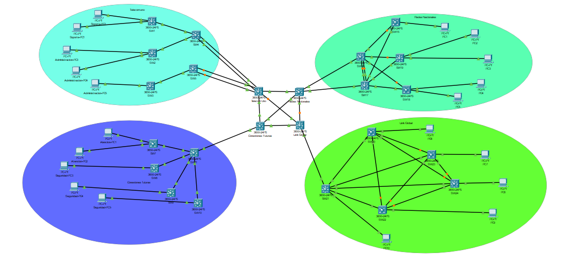

# PROYECTO 2

## INTEGRANTES GRUPO NO. 17

| Nombre                      | Carné    |
| --------------------------- | --------- |
|                             |           |
| Douglas Darío Rivera Ojeda | 201122881 |

# TOPOLOGÍA

Se creó una topología de red reducida que simula las interacciones entre los distintos edificios

# PROTOCOLO BGP

## Configuración para MSW1 (Telecom Uno)

enable
configure terminal
ip routing

interface loopback 0
ip address 1.1.1.1 255.255.255.255
no shutdown

interface vlan 100
ip address 172.17.0.1 255.255.255.252
no shutdown

interface vlan 101
ip address 172.17.0.5 255.255.255.252
no shutdown

interface vlan 102
ip address 172.17.0.9 255.255.255.252
no shutdown

router bgp 65001
bgp router-id 1.1.1.1
neighbor 172.17.0.2 remote-as 65002
neighbor 172.17.0.6 remote-as 65003
neighbor 172.17.0.10 remote-as 65004

## Configuración para MSW2 (Redes Nacionales)

enable
configure terminal
ip routing

interface loopback 0
ip address 2.2.2.2 255.255.255.255
no shutdown

interface vlan 100
ip address 172.17.0.2 255.255.255.252
no shutdown

interface vlan 103
ip address 172.17.0.13 255.255.255.252
no shutdown

interface vlan 104
ip address 172.17.0.17 255.255.255.252
no shutdown

router bgp 65002
bgp router-id 2.2.2.2
neighbor 172.17.0.1 remote-as 65001
neighbor 172.17.0.14 remote-as 65003
neighbor 172.17.0.18 remote-as 65004

## Configuración para MSW4 (Link Global)

Configuración para MSW3 (Conexiones Futuras)
enable
configure terminal
ip routing

interface loopback 0
ip address 3.3.3.3 255.255.255.255
no shutdown

interface vlan 101
ip address 172.17.0.6 255.255.255.252
no shutdown

interface vlan 103
ip address 172.17.0.14 255.255.255.252
no shutdown

interface vlan 105
ip address 172.17.0.21 255.255.255.252
no shutdown

router bgp 65003
bgp router-id 3.3.3.3
neighbor 172.17.0.5 remote-as 65001
neighbor 172.17.0.13 remote-as 65002
neighbor 172.17.0.22 remote-as 65004

## Configuración para MSW3 (Conexiones Futuras)

enable
configure terminal
ip routing

interface loopback 0
ip address 3.3.3.3 255.255.255.255
no shutdown

interface vlan 101
ip address 172.17.0.6 255.255.255.252
no shutdown

interface vlan 103
ip address 172.17.0.14 255.255.255.252
no shutdown

interface vlan 105
ip address 172.17.0.21 255.255.255.252
no shutdown

router bgp 65003
bgp router-id 3.3.3.3
neighbor 172.17.0.5 remote-as 65001
neighbor 172.17.0.13 remote-as 65002
neighbor 172.17.0.22 remote-as 65004

# CONFIGURACION Telecom Uno

## Configuración del Switch Telecom Uno (Capa 3)

enable
configure terminal
interface range GigabitEthernet1/0/4 - 5
switchport mode trunk
channel-group 1 mode active
interface Port-channel1
switchport mode trunk
description LACP-to-SW4

### Configuración de interfaces LACP hacia SW5

interface range GigabitEthernet1/0/6 - 7
switchport mode trunk
channel-group 2 mode active
interface Port-channel2
switchport mode trunk
description LACP-to-SW5
vlan 10
name SOPORTE
vlan 20
name ADMINISTRACION

interface vlan 10
ip address 192.168.18.1 255.255.255.128
no shutdown
interface vlan 20
ip address 192.168.18.129 255.255.255.128
no shutdown

router eigrp 100
network 192.168.18.0 0.0.0.255

## Configuración de SW4 (Capa 2)

enable
configure terminal
interface range GigabitEthernet1/0/1, GigabitEthernet1/0/4
switchport mode trunk
channel-group 1 mode active

interface Port-channel1
switchport mode trunk
description LACP-to-TelecomUno
interface GigabitEthernet1/0/2
switchport mode access
switchport access vlan 10

interface GigabitEthernet1/0/3
switchport mode access
switchport access vlan 10

## Configuración de SW5 (Capa 2)

enable
configure terminal
interface range GigabitEthernet1/0/1, GigabitEthernet1/0/3
switchport mode trunk
channel-group 2 mode active
interface Port-channel2
switchport mode trunk
description LACP-to-TelecomUno
interface GigabitEthernet1/0/2
switchport mode access
switchport access vlan 20
interface GigabitEthernet1/0/4
switchport mode access
switchport access vlan 20

### Configuración para los demás switches (SW1, SW2, SW3)

enable
configure terminal

vlan 10
name SOPORTE

vlan 20
name ADMINISTRACION

interface GigabitEthernet1/0/1
switchport mode trunk

interface GigabitEthernet1/0/2

switchport mode access
switchport access vlan 10

# VLANS 

## Computadoras en VLAN 10 (SOPORTE)

Soporte-PC1:

- Dirección IP: 192.168.18.2
- Máscara: 255.255.255.128
- Gateway: 192.168.18.1
- DNS: 8.8.8.8

Soporte-PC2:

- Dirección IP: 192.168.18.3
- Máscara: 255.255.255.128
- Gateway: 192.168.18.1
- DNS: 8.8.8.8

## Computadoras en VLAN 20 (ADMINISTRACIÓN)

Soporte-PC3:

- Dirección IP: 192.168.18.130
- Máscara: 255.255.255.128
- Gateway: 192.168.18.129
- DNS: 8.8.8.8

Soporte-PC4:

- Dirección IP: 192.168.18.131
- Máscara: 255.255.255.128
- Gateway: 192.168.18.129
- DNS: 8.8.8.8

Soporte-PC5:

- Dirección IP: 192.168.18.132
- Máscara: 255.255.255.128
- Gateway: 192.168.18.129
- DNS: 8.8.8.8

# Configuracion (Conexiones Futuras - Hub)

## Switch (conexxiones futuras)

enable
configure terminal

ip routing

vlan 10
name DESARROLLO

vlan 20
name INVESTIGACION

interface vlan 10
ip address 192.168.48.1 255.255.255.128
no shutdown

interface vlan 20
ip address 192.168.48.129 255.255.255.128
no shutdown

router ospf 1
router-id 1.1.1.1
network 192.168.48.0 0.0.0.255 area 0

## Configuración para los switches spoke (SW7, SW8, SW9, SW10)

enable
configure terminal

vlan 10
name DESARROLLO

vlan 20
name INVESTIGACION

interface GigabitEthernet1/0/1
switchport mode trunk

interface GigabitEthernet1/0/2
switchport mode access
switchport access vlan 10

interface GigabitEthernet1/0/3
switchport mode access
switchport access vlan 10

## Configuración para SW8

enable
configure terminal

vlan 10
name DESARROLLO

vlan 20
name INVESTIGACION

interface GigabitEthernet1/0/1
switchport mode trunk

interface GigabitEthernet1/0/2
switchport mode access
switchport access vlan 10

## Configuración para SW9

enable
configure terminal

vlan 10
name DESARROLLO

vlan 20
name INVESTIGACION

interface GigabitEthernet1/0/1
switchport mode trunk

interface GigabitEthernet1/0/2
switchport mode access
switchport access vlan 20

interface GigabitEthernet1/0/3
switchport mode access
switchport access vlan 20

## Configuración para SW10

enable
configure terminal

vlan 10
name DESARROLLO

vlan 20
name INVESTIGACION

interface GigabitEthernet1/0/1
switchport mode trunk

interface GigabitEthernet1/0/2
switchport mode access
switchport access vlan 20
